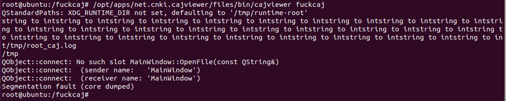
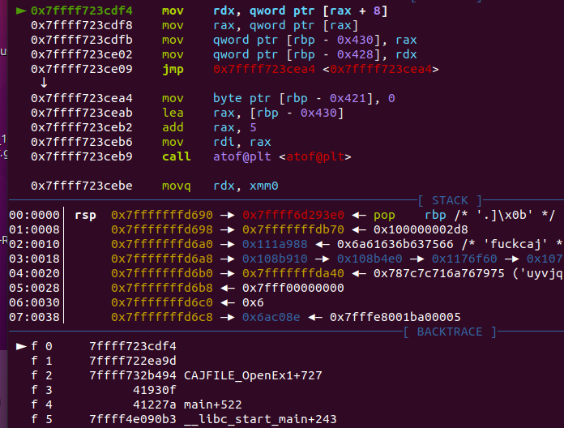
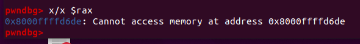
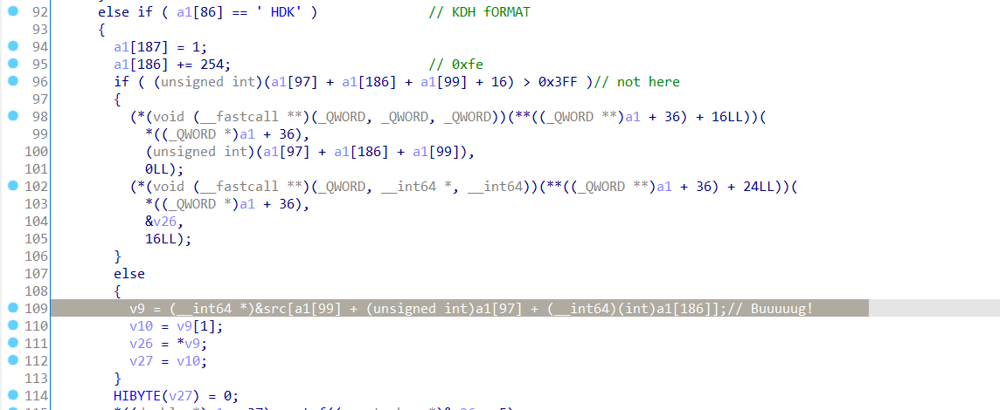

# Check if Poc works
We tested the bug on Ubuntu 20.04 AMD64.

By issuing following command and observing output of the terminal, we can confirm that a memory corruption problem exists in CAJViewer For Linux 1.0.3.0 AMD64. 

```bash
/opt/apps/net.cnki.cajviewer/files/bin/cajviewer fuckcaj
```


# What makes the program crash?

To understand what's happend inside CAJViewer, we use pwndbg to debug CAJViewer by running following command.

```bash
gdb --args /opt/apps/net.cnki.cajviewer/files/bin/cajviewer fuckcaj
```

After loading the target program in gdb,  we use following gdb command to ask gdb to trace parent process and run

```
set follow-fork-mode parent
run
```

We find that the program stuck in a MOV instruction.


It looks like this instruction is trying to read contents from an invalid memory address which leads to the crash


# Analyze the cause

By searching these instruction, we can identify that the crash happens in PDFDoc::open function in IDA Pro. To specify, in pseudo-C code line 109



We notice that starting at index 86, the array a1 contains data.

So, the a1\[186\] has been set as 0x254 which is not controllable for attacker.The a1\[97\] is 4\*(97-86)+1=45 th byte of the input file which is controllable for attacker, and the a1\[99\] is 4\*(99-86)=53 th byte of the input file which is controllable for attacker.

As a result, the sum of these value is controllable for attacker. Thus, an attacker can control the array index of array src, causing an out-of-bounds read. An attacker may leverage this to cause a denial-of-service and potential code execution in CAJViewer.

Developers of CAJViewer must have thought this problem before and added line 96 to check if the sum is too big for array src.
However they check by calculating them as 32bit integer but use them as 64bit integer. So an overflow in 32bit integer can bypass the check. For example, In our case, a1\[99\] +a1\[97\]+a1\[186\]=0xffffff00+0x00+0xfe=0xfffffffe, much bigger than expected array index, causing the program to attempt to read invalid memory address.

